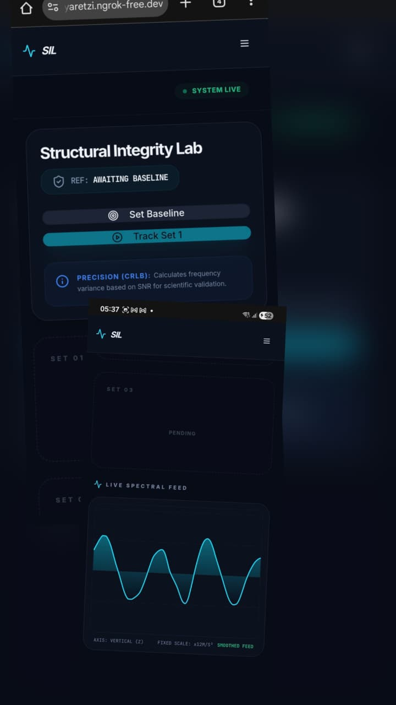
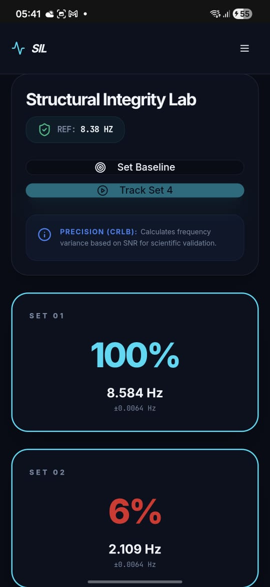

# Equation-Escape-Hackathon
A 15-hour coding marathon bringing together developers, designers, and innovators to create exciting, fun, and original projects. 


# SIL(Structural Integrity Lab)

## Basic Details

**Team Name:** TechMavu

### Team Members
- **Team Lead:** **Adithya Kiran** - **TKM College of Engineering**
- **Member 2:** **Goutham K C** - **TKM College of Engineering**
- **Member 3:** **Sredha Gopan** - **TKM College of Engineering**

## Project Description
**SIL** is a low-cost, high-precision Structural Health Monitoring (SHM) system that transforms a standard smartphone into a sophisticated vibration sensor. It utilizes real-time spectral analysis to detect structural micro-shifts and calculate the integrity of infrastructure like bridges and buildings.

## The Concept
The core idea is to measure the natural frequency of a structure—the specific rate at which it vibrates—to assess its health. Because a structure's frequency is directly linked to its stiffness, any drop in that frequency serves as an early warning sign of cracks, loose joints, or material fatigue.

Structural Mechanics ($f \propto \sqrt{k}$): We use the physical principle that the natural frequency ($f$) is proportional to the square root of stiffness ($k$). A drop in $f$ mathematically proves a loss in structural integrity.

Welch’s Power Spectral Density (PSD): Instead of a standard FFT, we apply Welch’s method to average signal segments, reducing noise and providing a clear "peak" for the natural frequency.

Cramér-Rao Lower Bound (CRLB): We calculate the theoretical minimum variance of our frequency estimates based on the Signal-to-Noise Ratio (SNR). This provides a scientific "error margin" ($\pm$ Hz) to distinguish between real structural damage and random sensor noise.

Digital Signal Processing (DSP): The system uses detrending to remove gravity offsets and low-pass filtering to smooth the visual waveform for real-time monitoring.

## Technical Details

### Technologies Used
- **Languages:** TypeScript, Python, HTML
- **Frameworks:** React, FastAPI, TailWind CSS, Vite
- **Libraries/Assets:** Scipy, Numpy, Recharts, Lucide React, Web DeviceMotion API, TanStack Query
- **Tools:** Bun, Uvicorn, ngrok, VS Code

### Implementation

#### Installation / Setup

To build and run **SIL** manually from source, you need to set up both the **React frontend** and the **FastAPI backend**.

### 1. Prerequisites
Ensure you have the following installed on your system:
* **Bun** (Recommended) or **Node.js** (v18+)
* **Python** (v3.9 or higher)
* **ngrok** (Required for mobile sensor access via HTTPS)
---

### 2. Backend Setup (FastAPI)
The backend handles the complex mathematical calculations and spectral analysis.
1. **Navigate to the backend directory:**
```bash
cd backend

```

2. **Create a virtual environment:**
```bash
python -m venv venv

```

3. **Activate the environment:**
* **Windows:** `venv\Scripts\activate`
* **Mac/Linux:** `source venv/bin/activate`

4. **Install dependencies:**
```bash
pip install fastapi uvicorn numpy scipy

```

5. **Start the server:**
```bash
uvicorn main:app --reload --port 8000

```

---

### 3. Frontend Setup (React + Vite)

The frontend provides the real-time dashboard and captures sensor data.
1. **Navigate to the project root:**
```bash
cd ..

```

2. **Install packages:**
```bash
bun install
# or npm install
# or npm i

```

3. **Launch the development server:**
```bash
bun dev
# or npm run dev

```

*Note: The frontend will run on port `8080` by default as configured in your `vite.config.ts`.*

---

### 4. Mobile Hardware Access (ngrok Tunnel)

Because mobile browsers block motion sensors on standard `http` links, you must use an **HTTPS tunnel** to test on your phone.

1. **Start the ngrok tunnel:**
```bash
ngrok http 8080

```

2. **Update Config:** Copy the generated `ngrok-free.dev` URL and ensure it is listed in the `allowedHosts` section of your `vite.config.ts`.
3. **Access:** Open the ngrok URL on your smartphone browser.

---

## Project Documentation

### Screenshots

.png)



### Project Demo

#### Project Video

In the video, first the baseline is set when no objects are on the table, after which heavy objects are added, which causes a decrease in frequency similar to structural weakening or a shift in the mass-to-stiffness ratio of an aging bridge. Adding mass ($m$) without increasing stiffness ($k$) lowers the natural frequency ($f \approx \sqrt{k/m}$).
SHM Concept: This shift simulates material fatigue or dead-load stress, which the system detects as a drop in the Integrity Score

https://drive.google.com/file/d/1ZcEL84vzJnZxVozQju2WSu8vaLnVVKuy/view?usp=drivesdk

## Deployment
- **Deployed Version :** [https://mathventures-ten.vercel.app/]
